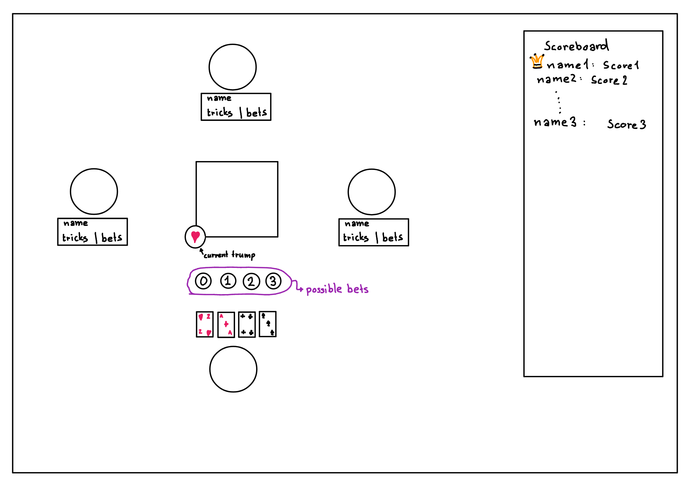
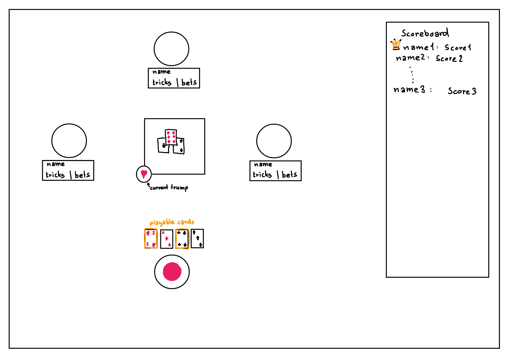
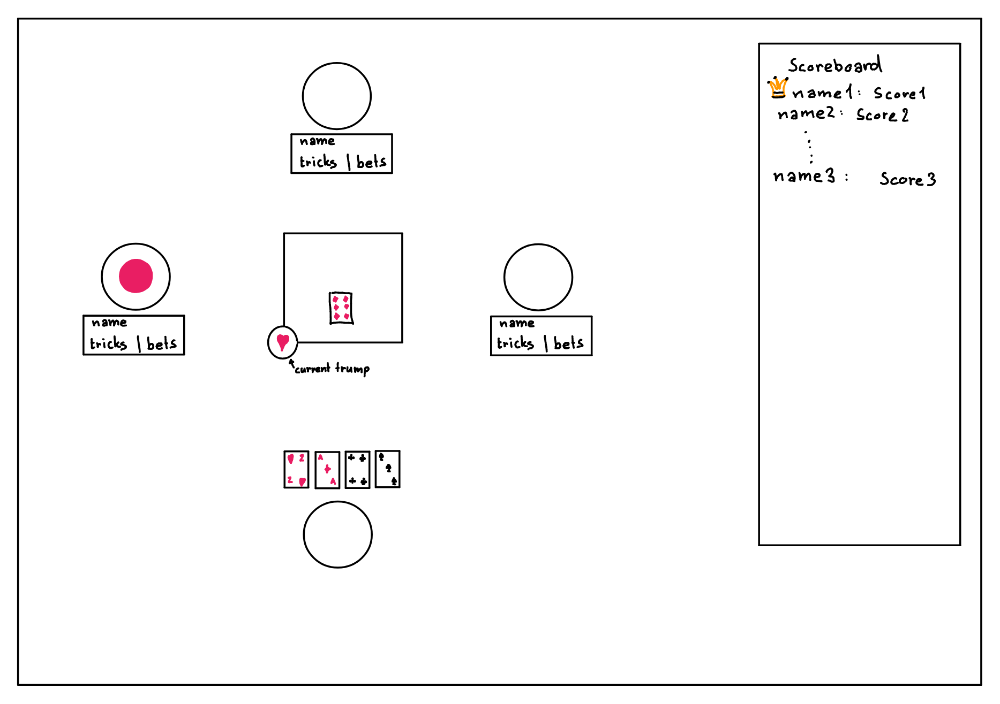
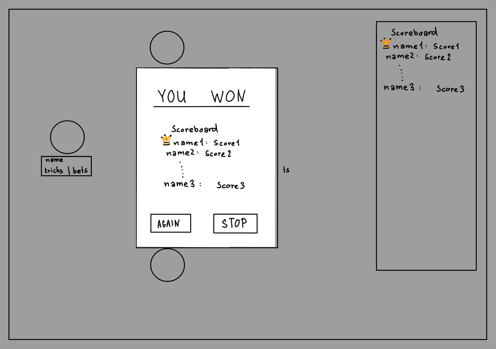

# Team 64 - Wizard (Card Game)
We are recreating the card game ['Wizard'](https://en.wikipedia.org/wiki/Wizard_(card_game)), described in the following.

## How to play
First of all, start the server as usual:
```bash
~/.../app64 $ sbt --client run
```
Then, in your browser, navigate to `localhost:8080` and click on *Wizard*, then follow the onscreen instructions to create a game.

### Gameplay
Once in the game, players first take turns announcing how many **tricks** they think they will win with their current hand, which we refer to as **bids**.  

A player wins a trick by having playing the the highest valid card in that play. A card is valid if it is of the current trump suit (displayed in the middle of the cards), if it is of the same suit as the first card in that play or it is a special card.
There are two special cards, the jester (🃏, always the lowest card) and the wizard (🧙, always the highest card) which can be played no matter which other cards have been played.  

After having announced the bids, the players start playing cards one after another. This is referred to as a **play**.
A play ends when every player has played one card, after which the winner of that play's trick is determined and announced. That player is also the player that starts the next play.
A **round** ends once all players have no more cards, after which the score changes for that round are displayed. Every round, the number of cards increases by 1 until `60 / <number of players>` is reached.

The goal of each player is to make *as many tricks as they announced bids* per round. Doing so will result in *gaining 20 points plus 10 points per trick*. Failing to reach the bids, or overshooting them, results in *losing 10 points per trick over / under the bids*.

The scores are always visible at the bottom of the page.

At the end of the game, the player with the most points wins, as usual.

<br>

## Dependencies
The webapp uses the following libraries:
- `com.lihaoyi.`
  - `upickle, ujson`, see [GitHub](https://github.com/com-lihaoyi/upickle)
  - `scalatags`, see [GitHub](https://github.com/com-lihaoyi/scalatags)

<br>

- `org.`
  - `scalactic`, see [scalactic.org](https://www.scalactic.org/)
  - `scalatest`, see [scalatest.org](https://www.scalatest.org/)
  - `scala-js`, see [scala-js.org](https://www.scala-js.org/)

<br>

And of course it uses the [CS-214 webapp library](https://gitlab.epfl.ch/cs214/ul2024/webapp-lib.git#v0.15.0).  
These should all be automatically managed by the `build.sbt` file.

<br>

## Team members
```
 - Bernardi Leoluca        - 374107, leoluca.bernardi@epfl.ch
 - Gorgani Ali             - 371956, ali.gorgani@epfl.ch
 - Metzler Mattia Gaël     - 372025, mattia.metzler@epfl.ch
 - Tamberg Anthony Andreas - 357610, anthony.tamberg@epfl.ch
```

<br>

## Proposal

### User stories
- As a player during the bidding phase, I want to be able to announce how many tricks I think I am going to make during the round.
- During the round, as a player, I want to play a legal card when it's my turn.
- At any time, I want to see my score, the current trump card and my current hand. I also want to see the other players, to know whose turn it is and to see how close they are to their goal of bids.
- As a player, at the end of a round, I want to see who won the trick and what the resulting points are. At the end of the game, I want to see who won with how many points.
- As a player, I don't want other players to see my cards.

### Requirements
- Entering a bid should save and display it next to the user's name for that round.
- Currently playable cards should be highlighted clearly and non-playable ones should not be clickable.
- Clicking a playable card should play the card by putting it in the middle with the other cards.
- The number of cards in the first round should be one.
- Once all cards have been played, the round should stop. The cards will be reshuffled and the number of cards for the next round should increment by one.
- The amount of cards in the last round is 60 divided by the number of players. After this round, the game should end and the scores should be displayed.
- Throughout the game, a counter should keep track of the scores.

### Mock-up
Bidding phase:


Turn of the player seeing this view:


Turn of some other player:


End of the game:


### Roles
```
Ali:     Intergration & Testing
Anthony: Backend
Leoluca: Backend / Integration & Testing
Mattia:  Frontend
```
